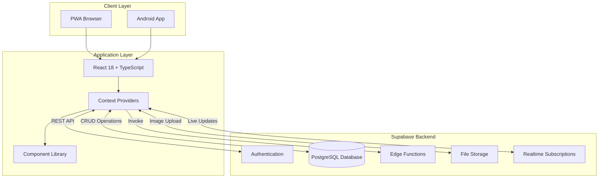
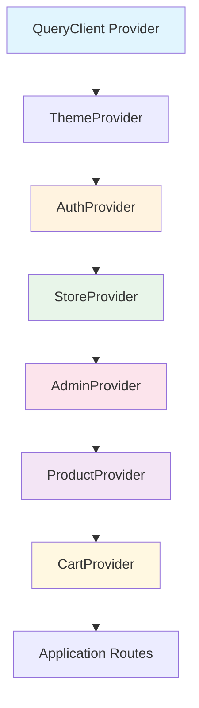
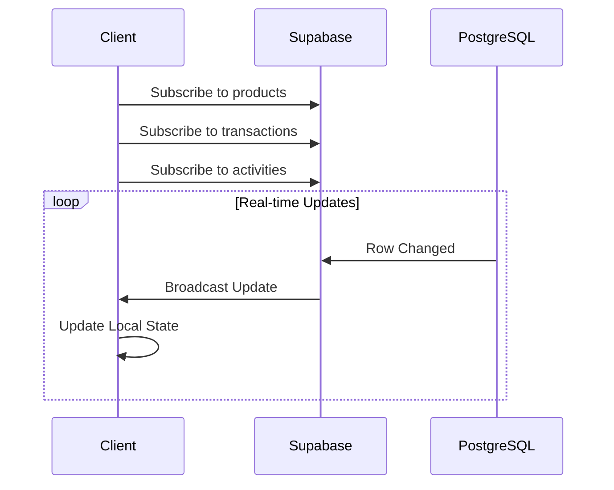
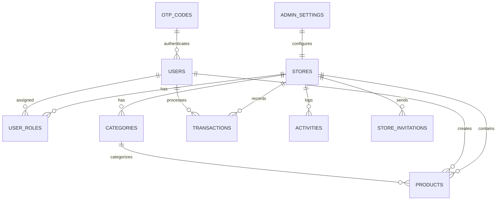
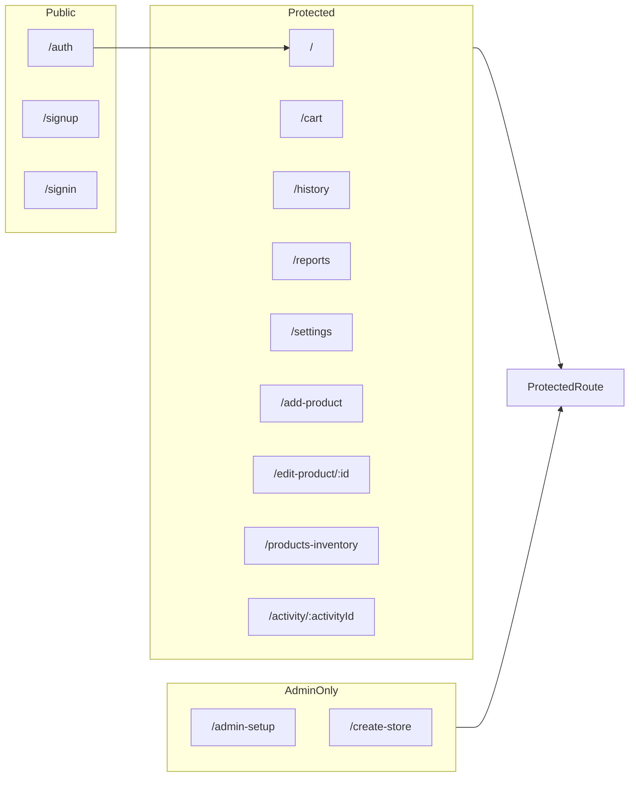
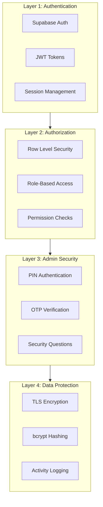

# Quik Shopping - Enterprise Point of Sale System

## Complete Technical Documentation & Architecture Guide

---

## Executive Summary

**Quik Shopping** is a production-ready, cloud-based Point of Sale (POS) application designed specifically for Nigerian businesses. Built as a Progressive Web App (PWA) with native Android support via Capacitor, it offers enterprise-grade functionality including real-time inventory management, multi-payment processing, role-based access control, and comprehensive analytics.

### Key Value Propositions

- **75-85% cost reduction** compared to traditional POS systems (₦200k-300k/month)
- **Zero hardware investment** - works on any device with a browser
- **Cloud-first architecture** - access from anywhere with real-time sync
- **Nigerian market optimized** - local payment methods and currency support

### Current Status

The application is fully functional and deployed, featuring:

- ✅ Complete product management with image uploads
- ✅ Multi-cart checkout system
- ✅ Three payment methods (Cash, POS, Transfer)
- ✅ Role-based access control (Owner/Manager/Cashier)
- ✅ PIN-based admin authentication with OTP recovery
- ✅ Real-time analytics and PDF report generation
- ✅ PWA with offline support
- ✅ Native Android app via Capacitor

---

## Technology Stack

### Frontend Technologies

| Technology           | Version | Purpose                        |
| -------------------- | ------- | ------------------------------ |
| **React**            | 18.3.1  | UI Framework with modern hooks |
| **TypeScript**       | 5.5.3   | Static type checking           |
| **Vite**             | 5.4.1   | Next-gen build tool with HMR   |
| **Tailwind CSS**     | 3.4.11  | Utility-first CSS framework    |
| **shadcn/ui**        | Latest  | 49 accessible UI components    |
| **React Router DOM** | 6.26.2  | Client-side routing            |
| **TanStack Query**   | 5.56.2  | Server state management        |
| **Recharts**         | 2.12.7  | Data visualization             |
| **date-fns**         | 3.6.0   | Date manipulation              |

### Backend & Database

| Technology             | Purpose                                                   |
| ---------------------- | --------------------------------------------------------- |
| **Supabase**           | Backend-as-a-Service (Auth, Database, Functions, Storage) |
| **PostgreSQL**         | Relational database (via Supabase)                        |
| **Row Level Security** | Fine-grained data access control                          |
| **Edge Functions**     | Serverless compute for secure operations                  |

### Mobile & PWA

| Technology                            | Purpose                          |
| ------------------------------------- | -------------------------------- |
| **Capacitor**                         | Native app container for Android |
| **@capacitor-mlkit/barcode-scanning** | ML-powered barcode scanning      |
| **next-themes**                       | Dark/light theme support         |
| **Service Workers**                   | Offline functionality            |

---

## System Architecture

### High-Level Architecture Diagram



### Context Provider Architecture



---

## Context Providers Deep Dive

### 1. SupabaseAuthContext

**File:** `src/contexts/SupabaseAuthContext.tsx` (137 lines)

Manages user authentication state with Supabase Auth.

```typescript
interface AuthContextType {
  user: User | null;
  session: Session | null;
  loading: boolean;
  signIn: (email: string, password: string) => Promise<void>;
  signUp: (email: string, password: string) => Promise<void>;
  signOut: () => Promise<void>;
}
```

**Key Features:**

- Email/password authentication
- Session persistence via localStorage
- Automatic token refresh
- Auth state change listeners

---

### 2. StoreContext - Role-Based Access Control

**File:** `src/contexts/StoreContext.tsx` (213 lines)

Implements multi-tenant store management with granular permissions.

```typescript
interface StoreContextType {
  activeStore: Store | null;
  userRole: "owner" | "manager" | "cashier" | null;
  stores: Store[];
  userRoles: UserRole[];
  setActiveStore: (storeId: string) => void;
  hasPermission: (permission: Permission) => boolean;
  loading: boolean;
  refreshStores: () => Promise<void>;
}
```

#### Permission Matrix

| Permission         | Description              | Owner | Manager | Cashier |
| ------------------ | ------------------------ | :---: | :-----: | :-----: |
| `products:view`    | View product catalog     |  ✅   |   ✅    |   ✅    |
| `products:write`   | Add/edit/delete products |  ✅   |   ✅    |   ❌    |
| `sales:write`      | Process transactions     |  ✅   |   ✅    |   ✅    |
| `reports:view`     | Access analytics         |  ✅   |   ✅    |   ✅    |
| `inventory:manage` | Manage stock levels      |  ✅   |   ✅    |   ❌    |
| `team:manage`      | Invite/remove team       |  ✅   |   ❌    |   ❌    |
| `settings:manage`  | Modify store settings    |  ✅   |   ❌    |   ❌    |

---

### 3. AdminContext - PIN Authentication

**File:** `src/contexts/AdminContext.tsx` (577 lines)

Handles admin mode with PIN-based authentication and security features.

```typescript
interface AdminContextType {
  isAdminMode: boolean;
  adminSettings: AdminSettings | null;
  setupAdmin: (
    email,
    whatsapp,
    pin,
    confirmPin,
    question,
    answer
  ) => Promise<void>;
  signInAdmin: (pin: string) => Promise<void>;
  signOutAdmin: () => void;
  resetPin: (newPin: string, confirmPin: string) => Promise<void>;
  toggleCashierDialogDisabled: (disabled: boolean) => Promise<void>;
  toggleAdminProductRequirement: (require: boolean) => Promise<void>;
  addManagedCashier: (name: string) => Promise<void>;
  removeManagedCashier: (name: string) => Promise<void>;
  setCashierSignInMode: (mode: "dropdown" | "freetext") => Promise<void>;
}
```

**Security Features:**

- 4-6 digit PIN authentication
- Security question recovery
- WhatsApp OTP verification
- Session expiration handling
- Managed cashier list

---

### 4. SupabaseProductContext - Product Management

**File:** `src/contexts/SupabaseProductContext.tsx` (1,283 lines)

The largest context, handling all product, category, transaction, and activity operations.

```typescript
interface ProductContextType {
  products: Product[];
  categories: Category[];
  transactions: Transaction[];
  activityLogs: ActivityLog[];
  loading: boolean;

  // Product Operations
  addProduct: (
    product: Omit<Product, "id">,
    cashierName?: string
  ) => Promise<void>;
  updateProduct: (
    id: string,
    product: Partial<Product>,
    cashierName?: string
  ) => Promise<void>;
  deleteProduct: (id: string, cashierName?: string) => Promise<void>;
  updateProductQuantity: (
    id: string,
    change: number,
    silent?: boolean
  ) => Promise<void>;

  // Category Operations
  addCategory: (name: string, cashierName?: string) => Promise<void>;
  editCategory: (
    id: string,
    name: string,
    cashierName?: string
  ) => Promise<void>;
  deleteCategory: (id: string, cashierName?: string) => Promise<void>;

  // Transaction & Activity
  addTransaction: (transaction: Transaction) => Promise<void>;
  logActivity: (
    activity: Omit<ActivityLog, "id" | "timestamp">
  ) => Promise<void>;

  // Loading Functions
  loadProducts: (force?: boolean) => Promise<void>;
  loadTransactions: (force?: boolean) => Promise<void>;
  loadActivities: (force?: boolean) => Promise<void>;
}
```

#### Real-time Subscriptions



---

### 5. CartContext - Multi-Cart System

**File:** `src/contexts/CartContext.tsx` (404 lines)

Supports up to 10 concurrent shopping carts with validation.

```typescript
interface Cart {
  id: string;
  name: string;
  items: CartItem[];
  total: number;
  createdAt: Date;
  status: "active" | "minimized";
}

interface MultiCartState {
  carts: Cart[];
  activeCartId: string | null;
}
```

**Features:**

- Create/switch/close carts
- Item quantity validation against inventory
- Auto-adjustment when stock changes
- Persistent storage via localStorage
- Race condition prevention

---

## Database Schema

### Entity Relationship Diagram



### Core Tables

#### stores

| Column                              | Type    | Description              |
| ----------------------------------- | ------- | ------------------------ |
| `id`                                | UUID    | Primary key              |
| `owner_user_id`                     | UUID    | FK to auth.users         |
| `store_name`                        | TEXT    | Business name            |
| `store_email`                       | TEXT    | Contact email            |
| `whatsapp_number`                   | TEXT    | WhatsApp for OTP         |
| `admin_pin_hash`                    | TEXT    | Hashed admin PIN         |
| `security_question`                 | TEXT    | Recovery question        |
| `security_answer_hash`              | TEXT    | Hashed answer            |
| `disable_cashier_dialog`            | BOOLEAN | Skip cashier prompts     |
| `require_admin_for_product_actions` | BOOLEAN | Lock product changes     |
| `cashier_sign_in_mode`              | TEXT    | 'dropdown' or 'freetext' |

#### products

| Column        | Type    | Description          |
| ------------- | ------- | -------------------- |
| `id`          | UUID    | Primary key          |
| `user_id`     | UUID    | FK to auth.users     |
| `store_id`    | UUID    | FK to stores         |
| `name`        | TEXT    | Product name         |
| `price`       | NUMERIC | Unit price           |
| `quantity`    | INTEGER | Stock level          |
| `category_id` | UUID    | FK to categories     |
| `image_url`   | TEXT    | Supabase Storage URL |
| `description` | TEXT    | Product details      |
| `created_by`  | UUID    | Creator reference    |

#### transactions

| Column            | Type    | Description               |
| ----------------- | ------- | ------------------------- |
| `id`              | UUID    | Primary key               |
| `user_id`         | UUID    | FK to auth.users          |
| `store_id`        | UUID    | FK to stores              |
| `items`           | JSONB   | Array of cart items       |
| `total`           | NUMERIC | Transaction amount        |
| `payment_method`  | TEXT    | 'cash', 'pos', 'transfer' |
| `cashier_name`    | TEXT    | Processing cashier        |
| `customer`        | JSONB   | Customer details          |
| `cashier_user_id` | UUID    | Cashier account           |

#### user_roles

| Column       | Type         | Description                   |
| ------------ | ------------ | ----------------------------- |
| `id`         | UUID         | Primary key                   |
| `user_id`    | UUID         | FK to auth.users              |
| `store_id`   | UUID         | FK to stores                  |
| `role`       | USER-DEFINED | 'owner', 'manager', 'cashier' |
| `is_active`  | BOOLEAN      | Active status                 |
| `invited_by` | UUID         | Inviter reference             |

#### activities

| Column        | Type  | Description         |
| ------------- | ----- | ------------------- |
| `id`          | UUID  | Primary key         |
| `user_id`     | UUID  | FK to auth.users    |
| `store_id`    | UUID  | FK to stores        |
| `type`        | TEXT  | Activity category   |
| `description` | TEXT  | Human-readable log  |
| `details`     | JSONB | Additional metadata |

---

## Supabase Edge Functions

12 serverless functions handle secure server-side operations:

### Authentication & Security

| Function            | Purpose                   | Trigger               |
| ------------------- | ------------------------- | --------------------- |
| `admin-setup`       | Initialize admin account  | First-time setup      |
| `admin-verify`      | Validate PIN against hash | Admin sign-in         |
| `admin-reset-pin`   | Reset PIN via OTP         | Forgot PIN flow       |
| `send-otp`          | Email OTP delivery        | PIN reset request     |
| `send-whatsapp-otp` | WhatsApp OTP delivery     | Alternative recovery  |
| `verify-otp`        | Validate OTP code         | Recovery confirmation |

### Security Questions

| Function                   | Purpose                      |
| -------------------------- | ---------------------------- |
| `update-security-question` | Store new security Q&A       |
| `verify-security-answer`   | Validate answer for recovery |
| `update-whatsapp-number`   | Update recovery phone        |

### Team Management

| Function                  | Purpose                       |
| ------------------------- | ----------------------------- |
| `send-cashier-invitation` | Email invitation links        |
| `accept-invitation`       | Process invitation acceptance |
| `send-email`              | Generic email utility         |

---

## Application Pages

### Page Inventory

| Page                  | File                    | Lines | Description                     |
| --------------------- | ----------------------- | ----- | ------------------------------- |
| **Home**              | `Home.tsx`              | 210   | Product grid with search/filter |
| **Cart**              | `Cart.tsx`              | 782   | Multi-cart checkout flow        |
| **History**           | `History.tsx`           | 720   | Transaction history             |
| **Reports**           | `Reports.tsx`           | 500   | Analytics dashboard             |
| **Settings**          | `Settings.tsx`          | 850   | Admin controls & preferences    |
| **AddProduct**        | `AddProduct.tsx`        | 390   | Product creation form           |
| **EditProduct**       | `EditProduct.tsx`       | 410   | Product modification            |
| **ProductsInventory** | `ProductsInventory.tsx` | 430   | Full inventory view             |
| **AdminSetup**        | `AdminSetup.tsx`        | 420   | First-time admin config         |
| **Auth**              | `Auth.tsx`              | 290   | Sign in/up forms                |
| **CreateStore**       | `CreateStore.tsx`       | 175   | New store wizard                |
| **ActivityDetails**   | `ActivityDetails.tsx`   | 1,300 | Audit log viewer                |

### Routing Architecture



---

## Component Library

### Custom Business Components (22)

| Component                | Purpose                             |
| ------------------------ | ----------------------------------- |
| `AdminSetupDialog`       | First-time admin setup wizard       |
| `AdminSignInDialog`      | PIN entry for admin mode            |
| `AppWalkthrough`         | Interactive onboarding tour         |
| `BarcodeScanner`         | MLKit barcode scanning integration  |
| `CashierDialog`          | Simple cashier name input           |
| `CashierManagement`      | Manage cashier list (CRUD)          |
| `CategoryFilter`         | Product category chip selector      |
| `CategoryManager`        | Full category management            |
| `ClearDataDialog`        | Destructive action confirmation     |
| `EnhancedCashierDialog`  | Dropdown/freetext cashier selection |
| `FAQSection`             | Accordion-based help content        |
| `ForgotPinDialog`        | PIN recovery flow (OTP/Security)    |
| `InviteCashierDialog`    | Team invitation form                |
| `Layout`                 | Main app layout with navigation     |
| `ProductCard`            | Product display with add-to-cart    |
| `ProtectedRoute`         | Authentication route guard          |
| `PullToRefresh`          | Mobile pull-to-refresh gesture      |
| `SearchBar`              | Product search with barcode button  |
| `SecurityQuestionDialog` | Security Q&A setup                  |
| `SecurityWarning`        | Dismissible security alerts         |
| `TeamManagement`         | Team member list & roles            |
| `WhatsAppNumberDialog`   | WhatsApp recovery setup             |

### UI Components (49 shadcn/ui)

Complete component library including:

- **Layout:** `Card`, `Dialog`, `Sheet`, `Drawer`, `Sidebar`
- **Forms:** `Input`, `Button`, `Select`, `Checkbox`, `Switch`, `RadioGroup`
- **Feedback:** `Toast`, `Alert`, `Progress`, `Skeleton`
- **Navigation:** `Tabs`, `NavigationMenu`, `Breadcrumb`, `Pagination`
- **Data Display:** `Table`, `Chart`, `Avatar`, `Badge`
- **Overlay:** `Popover`, `Tooltip`, `HoverCard`, `ContextMenu`

---

## Build & Deployment

### NPM Scripts

```bash
# Development
npm run dev          # Start Vite dev server with HMR

# Production
npm run build        # Build for production
npm run preview      # Preview production build

# Mobile
npm run mobile:build # Build + Capacitor sync for Android

# Quality
npm run lint         # ESLint code analysis
```

### Capacitor Configuration

```typescript
// capacitor.config.ts
const config: CapacitorConfig = {
  appId: "com.quikshopping.pos",
  appName: "Quik Shopping",
  webDir: "dist",
  server: {
    androidScheme: "https",
  },
};
```

### Deployment Targets

| Platform    | Method      | Configuration          |
| ----------- | ----------- | ---------------------- |
| **Web**     | Vercel      | `vercel.json`          |
| **Web**     | Lovable.dev | Git integration        |
| **Android** | Capacitor   | Android Studio project |

---

## Security Implementation

### Multi-Layer Security Model



### Row Level Security Policies

Key RLS policies enforcing data isolation:

| Table               | Policy                         | Effect                       |
| ------------------- | ------------------------------ | ---------------------------- |
| `products`          | Store members can view         | Read access for team         |
| `products`          | Owners and managers can manage | Full CRUD for elevated roles |
| `transactions`      | Cashiers can create            | Write access for all roles   |
| `transactions`      | Store members can view         | Read access for team         |
| `admin_settings`    | Users own their settings       | Strict ownership isolation   |
| `store_invitations` | Owners can manage              | Invitation control           |

---

## Type Definitions

### Core Interfaces

```typescript
// src/types/index.ts

interface Product {
  id: string;
  name: string;
  price: number;
  quantity: number;
  category: string;
  imageUrl?: string;
  description?: string;
  barcode?: string;
  createdAt?: Date;
  updatedAt?: Date;
}

interface Transaction {
  id: string;
  items: CartItem[];
  total: number;
  paymentMethod: "cash" | "pos" | "transfer";
  cashierName: string;
  customer?: Customer;
  timestamp: Date;
}

interface CartItem {
  id: string;
  productId: string;
  name: string;
  price: number;
  quantity: number;
  category: string;
}

interface Customer {
  name: string;
  phone: string;
}

type PaymentMethod = "cash" | "pos" | "transfer";

const PRODUCT_CATEGORIES = [
  "All",
  "Drinks",
  "Groceries",
  "Essentials",
  "Snacks",
  "Personal Care",
  "Household",
  "Electronics",
  "Other",
] as const;
```

---

## File Structure Overview

```
quik-shopping-edits-2/
├── src/
│   ├── App.tsx                 # Main app with routing (96 lines)
│   ├── main.tsx                # Entry point
│   ├── index.css               # Global styles
│   │
│   ├── contexts/               # State management (8 providers)
│   │   ├── SupabaseAuthContext.tsx
│   │   ├── StoreContext.tsx
│   │   ├── AdminContext.tsx
│   │   ├── SupabaseProductContext.tsx
│   │   ├── CartContext.tsx
│   │   └── ThemeContext.tsx
│   │
│   ├── pages/                  # 17 route components
│   │   ├── Home.tsx
│   │   ├── Cart.tsx
│   │   ├── History.tsx
│   │   ├── Reports.tsx
│   │   ├── Settings.tsx
│   │   └── ...
│   │
│   ├── components/             # 71 components
│   │   ├── ui/                 # 49 shadcn/ui components
│   │   └── [22 custom]
│   │
│   ├── hooks/                  # Custom hooks
│   │   ├── use-mobile.tsx
│   │   └── use-toast.ts
│   │
│   ├── lib/                    # Utilities
│   │   ├── utils.ts
│   │   ├── phoneUtils.ts
│   │   └── firebase.ts
│   │
│   ├── integrations/
│   │   └── supabase/
│   │       ├── client.ts       # Supabase client
│   │       └── types.ts        # Generated types
│   │
│   └── types/
│       └── index.ts            # TypeScript interfaces
│
├── supabase/
│   ├── functions/              # 12 Edge Functions
│   └── migrations/             # 6 SQL migrations
│
├── android/                    # Capacitor Android project
├── public/                     # Static assets
├── capacitor.config.ts         # Mobile config
├── tailwind.config.ts          # Tailwind theming
├── vite.config.ts              # Build configuration
└── package.json                # Dependencies
```

---

## Key Metrics

| Metric                 | Value                                |
| ---------------------- | ------------------------------------ |
| **Total Source Files** | 109+                                 |
| **Pages**              | 17                                   |
| **Components**         | 71                                   |
| **Context Providers**  | 8                                    |
| **Edge Functions**     | 12                                   |
| **Database Tables**    | 9                                    |
| **UI Components**      | 49                                   |
| **Dependencies**       | 59                                   |
| **Largest File**       | 1,283 lines (SupabaseProductContext) |

---

## Strategic Roadmap

### Phase 1: Core Enhancement (Q1 2025)

- Multi-currency support
- Advanced reporting dashboards
- Nigerian payment gateway integration (Paystack, Flutterwave)
- Enhanced mobile optimization

### Phase 2: Business Intelligence (Q2 2025)

- AI-powered sales forecasting
- Customer analytics and segmentation
- Inventory optimization recommendations
- Predictive reorder alerts

### Phase 3: Ecosystem Expansion (Q3 2025)

- Supplier management system
- Customer loyalty program
- E-commerce integration
- Multi-location dashboard

### Phase 4: Advanced Features (Q4 2025)

- Voice-activated commands
- Advanced barcode/QR integration
- Fraud detection
- White-label solutions

---

## Summary

Quik Shopping represents a **production-ready, enterprise-grade POS system** built with modern web technologies:

- ✅ **Full-stack TypeScript** for type safety across the entire codebase
- ✅ **Real-time data sync** via Supabase subscriptions
- ✅ **Multi-tenant architecture** with complete store isolation
- ✅ **Robust security** (PIN auth, OTP, security questions, RLS)
- ✅ **Native mobile** via Capacitor with barcode scanning
- ✅ **PWA capabilities** for offline-first experience
- ✅ **Comprehensive audit logging** for compliance
- ✅ **PDF report generation** with date filtering
- ✅ **Modern UI** with dark/light theming

---

_© 2025 Quik Shopping. All rights reserved._
